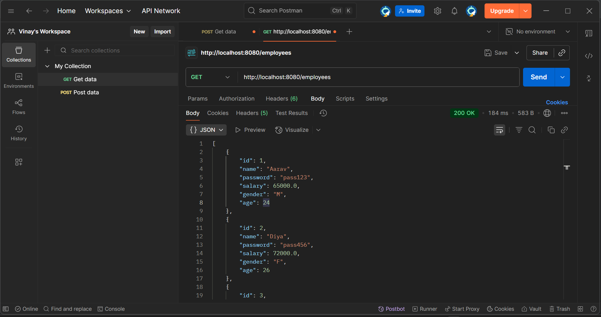
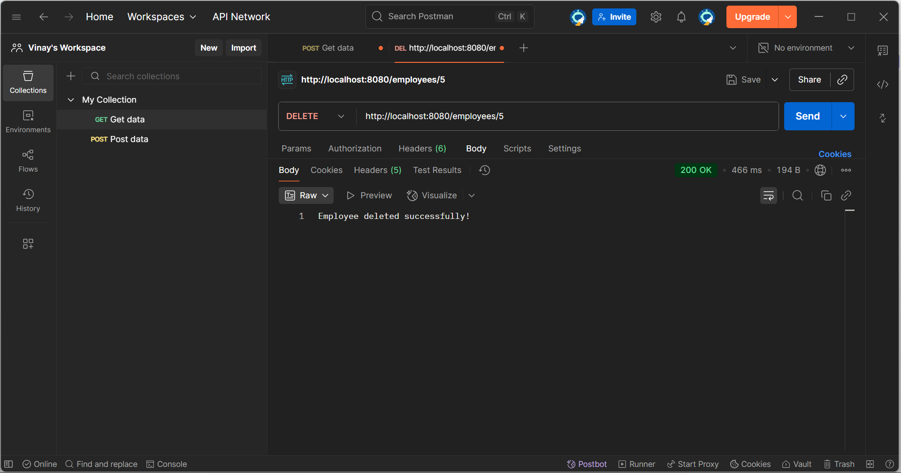

# Employee Management System - SP

A Spring Boot application for managing employees with JPA and MySQL.

## Features

- Create, Read, Update, and Delete (CRUD) employee records
- RESTful API endpoints
- MySQL database integration
- Spring Data JPA for data access

## Technologies Used

- Spring Boot 3.x
- Spring Data JPA
- MySQL
- Maven

## Setup

1. Clone the repository
2. Create a MySQL database named `kodnestemp`
3. Update `application.properties` with your database credentials
4. Run the application using `mvn spring-boot:run`

## API Endpoints

- `POST /employees` - Create a new employee
- `GET /employees` - Get all employees
- `GET /employees/{id}` - Get employee by ID
- `DELETE /employees/{id}` - Delete an employee

## Database Schema

```sql
CREATE TABLE Employee (
    id INT AUTO_INCREMENT PRIMARY KEY,
    password VARCHAR(255) NOT NULL,
    name VARCHAR(100) NOT NULL,
    salary DOUBLE NOT NULL,
    gender VARCHAR(10) NOT NULL,
    age INT NOT NULL
);
```
  
 

